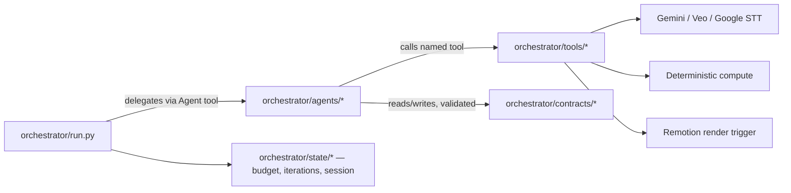

# Architecture Spine — book_reels — Claude Agent SDK Orchestration

## Design Paradigm

**Agentic pipes-and-filters.** The pipeline stays a sequential chain of stages (pipes-and-filters), but each filter is one of three things, never a mix:

1. A **Claude agent** — owns reasoning, writing, planning, or QA judgment.
2. A **Google/Gemini capability tool** — owns a capability Claude cannot perform itself (image generation/editing, TTS, video generation, speech alignment).
3. **Deterministic code** — owns pure computation with no judgment involved.

Every agent reaches (2) and (3) only through tools behind a hexagonal port — an agent never calls Gemini or a script directly; it calls a named tool, and the tool is the adapter. Layers map to directories:

```text
orchestrator/
  run.py       # core: top-level query(), session/budget/iteration state, failure-report writer
  agents/      # core: AgentDefinition specs — the reasoning filters
  tools/       # port/adapter: @tool-wrapped Gemini, Veo, STT, and deterministic calls
  contracts/   # the validated shape crossing every stage boundary
  state/       # run manifest: budget spent, iteration counts, session id
```



## Invariants & Rules

### AD-1 — Capability boundary: Gemini/Google only where Claude cannot act

- **Binds:** all agent and tool definitions
- **Prevents:** reasoning/writing/planning work being needlessly routed through Gemini when Claude can do it directly, and Claude being used for media generation it cannot perform
- **Rule:** Only image generation/editing, TTS synthesis, Veo video generation, and Google STT/Chirp alignment may be implemented as Google/Gemini API tool calls. All understanding (including raw image/screenshot understanding), writing, review, revision, and planning work is implemented as Claude agent reasoning over the input directly — never proxied through a Gemini text or vision call. `gemini_tools.py` therefore exposes only generation/editing and TTS, never an "understand this image" tool. `[ADOPTED]`

### AD-2 — Agent-per-responsibility, not one monolith

- **Binds:** `orchestrator/agents/`
- **Prevents:** a single agent prompt accumulating unrelated responsibilities (story writing mixed with Veo troubleshooting mixed with visual QA) and becoming unmaintainable
- **Rule:** Each pipeline responsibility — asset understanding, story writing, visual planning, Veo generation + QA, stills generation + QA, voice + word-timing + subtitle QA — is its own `AgentDefinition`, scoped to only the tools it needs. The top-level orchestrator delegates to these agents; it never performs a stage's reasoning itself. The one exemption is AD-13's preflight: a pass/fail verification involving no judgment, so it runs as plain orchestrator code, not an `AgentDefinition`.

### AD-3 — Existing scripts become in-process tools, not subprocesses

- **Binds:** `orchestrator/tools/`, the 14 existing root scripts
- **Prevents:** tool wrappers diverging on integration style — one shelling out, another importing — and disagreeing on error-handling and state-passing shape
- **Rule:** Every existing script's logic is refactored into a plain Python function wrapped with `@tool` + `create_sdk_mcp_server`, invoked in-process. No orchestrator tool shells out to `python script.py`. `[ADOPTED]`

### AD-4 — Validate-then-proceed at every stage boundary

- **Binds:** `orchestrator/contracts/`, every tool/agent handoff
- **Prevents:** a malformed or drifted output (e.g. `analyzed_assets.json` changing shape) silently breaking a downstream stage instead of failing where it happened; and "the API call returned 200" being mistaken for "the result is good" (the existing pipeline's own recorded lesson: generation succeeding is not the same as an asset being approved)
- **Rule:** Every stage's output must clear schema conformance against its pydantic contract model before the next agent or tool may consume it — always required, for every stage. A **generative/creative** output specifically (narration, a generated image or clip, a visual/shot plan, a prompt) additionally requires the producing agent's own semantic/quality judgment (visual QA for an artifact, tone-match for a prompt against its narration segment, duration/length targets for narration) before it counts as approved — schema validity alone is never treated as approval for these. A **deterministic-tool** output (ingest, word-timing alignment, subtitle segmentation) instead clears its quality gate via the mechanical validator already in the code (e.g. the existing alignment-ratio thresholds) and is never re-judged by an LLM — per the existing `AGENTS.md` ban on replacing deterministic subtitle segmentation with free-form LLM output. Either gate failing returns control to the producing agent/tool to self-correct and retry; nothing is passed downstream unvalidated. `[ADOPTED]`

### AD-5 — Bounded retry, no infinite loops

- **Binds:** every validate-and-reiterate loop, every agent definition
- **Prevents:** an agent looping indefinitely against an unfixable failure, burning cost with no terminal state
- **Rule:** Every retry/reiterate loop has an explicit iteration ceiling — default carried forward from existing code precedent (4 for a generate→review→revise loop, 3 for a transient-failure retry), overridable per agent where evidence justifies it `[ASSUMPTION — confirm per agent once real runs produce evidence]`. Exhausting the ceiling triggers AD-6, never another silent retry.

### AD-6 — Hard halt + failure report on exhausted retries

- **Binds:** `orchestrator/run.py`, every agent
- **Prevents:** the run silently degrading with a substituted asset, or blocking on a live prompt when nobody is watching
- **Rule:** When any agent exhausts its iteration ceiling without a valid result, the run halts at that stage and writes a diagnostic failure report to the run's output location. Every agent's report shares one minimal common envelope — stage id, failed contract name, attempt count, timestamp, partial-artifact paths — so AD-14's resume can read any agent's halt consistently; diagnostic detail beyond that envelope is agent-specific (format deferred). The run never substitutes a fallback asset and never waits on a live human response mid-run. `[ADOPTED]`

### AD-7 — Per-run budget ceiling

- **Binds:** `orchestrator/run.py`, every paid tool call
- **Prevents:** an autonomous run — nobody watching each stage — spending unbounded Gemini/Veo/TTS/STT cost, including an agent's own AD-5 retry loop blowing through the ceiling before `run.py` ever gets a chance to notice
- **Rule:** Every run is configured with a budget ceiling before it starts, via the SDK's `max_budget_usd` — the only *enforced* hard stop (it returns `error_max_budget_usd`). `TaskBudget`/`task_budget` is advisory token-pacing only (requires the `task-budgets-2026-03-13` beta) and never substitutes for `max_budget_usd`'s enforcement. Every paid tool call (Gemini/Veo/TTS/STT) checks remaining run budget synchronously immediately before executing, giving AD-5's per-agent loop and this ceiling one shared enforcement point. Hitting the ceiling halts the run the same way as AD-6 — failure report, no silent continuation. The ceiling's value is run-time configuration, not fixed in this spine. `[ADOPTED]`

### AD-8 — Locked artifacts protect approved reels, not in-run self-correction

- **Binds:** `orchestrator/agents/story_agent.py`, `visual_agent.py`, `voice_agent.py` (owns `subtitle_cues.json`); AD-4's retry loop
- **Prevents:** conflating "don't silently overwrite what the user already approved" with "an agent can't revise its own draft mid-run"; and conflating "a video rendered" with "a video was approved"
- **Rule:** The existing `AGENTS.md` prohibition on rewriting locked narration/subtitle cues/shot timing without explicit user direction governs a reel's artifacts only from the moment the human records approval at the final-review checkpoint (or an explicit reject/regenerate signal) — never merely from "the video rendered." Before that recorded event, any agent's own validate-and-reiterate loop may freely revise its own draft while producing the reel end-to-end; those in-run revisions are the mechanism, not a violation. A re-invocation before approval is unambiguously AD-14's resume; only after approval does touching those artifacts again become "a subsequent run" requiring explicit user direction.

### AD-9 — Veo/image-generation tools never receive a raw source screenshot

- **Binds:** `veo_agent.py`, `veo_tools.py`
- **Prevents:** repeating the pipeline's own documented failure mode, where a lost seed-result record silently fell back to feeding an uncleaned raw screenshot into Veo generation
- **Rule:** `veo_tools`'s generation call only accepts a path produced by the image-recomposition tool under its own contract. It rejects and fails loud on a `source_images/` path rather than silently substituting one. `[ADOPTED — carries forward existing AGENTS.md policy]`

### AD-10 — Per-shot contracts are keyed and merged by a single writer, never overwritten wholesale

- **Binds:** `orchestrator/contracts/`, `orchestrator/state/`, `orchestrator/run.py`
- **Prevents:** repeating the pipeline's own documented bug, where generating one shot's asset silently erased another already-recorded shot's result (a lost GCS URI, a lost seed reference); and a lost-update race where two agents each independently read-merge-write the same shot-keyed file
- **Rule:** Any contract or state file that accumulates one entry per shot (or other unit) is written via a keyed upsert — merge by shot id — never a full-file overwrite driven by a single-shot run. The orchestrator (`run.py`) is the sole writer-of-record for any such shared file: an agent returns its validated per-shot result to the orchestrator, which performs the merge; no agent writes the shared file directly.

### AD-11 — Production asset selection goes through a named manifest, never a heuristic

- **Binds:** `veo_agent.py`, `stills_agent.py`, `orchestrator/contracts/`
- **Prevents:** repeating the pipeline's own documented bug, where an old test object left in the GCS bucket was nearly mistaken for the real shot because a script picked "newest" or "largest" instead of the approved mapping
- **Rule:** A `ProductionAssetsContract` records the one approved artifact per shot, subject to AD-10's single-writer rule. Any agent selecting a generated asset for downstream use reads this contract; it never infers "the right one" from bucket listing, filename, or recency.

### AD-12 — Veo results are inspected structurally, never assumed from a coarse status

- **Binds:** `veo_tools.py`, `veo_agent.py`, `orchestrator/contracts/`
- **Prevents:** repeating the pipeline's own documented failure, where a "completed" operation still needed manual inspection to find the actual video URI or an RAI-filter rejection reason; and two independently-built components disagreeing on the shape of a Veo failure
- **Rule:** The Veo tool inspects both `operation.response` and `operation.result`, distinguishes `video.uri` from `video.video_bytes`, and surfaces any RAI-filter reason as an instance of one named `VeoFailureContract` (in `orchestrator/contracts/`) — never an ad hoc shape invented independently of AD-4's contract model — feeding AD-4/AD-5's validate-and-retry loop.

### AD-13 — Credential/environment preflight runs before any budget is spent

- **Binds:** `orchestrator/run.py`
- **Prevents:** an unattended autonomous run burning turns and wall-clock time only to fail on the first Google API call because ADC/Vertex auth or GCS bucket access was never valid — including a *resumed* run that skips this check because it isn't literally starting at stage 1
- **Rule:** Before executing the first stage of **any** invocation — a fresh run or an AD-14 resume starting from a later stage — the orchestrator verifies Google Cloud ADC/Vertex auth and required bucket access; a preflight failure halts immediately (AD-6's failure-report path) before any agent or paid API call runs.

### AD-14 — A halted run resumes from its last valid stage, never restarts from scratch

- **Binds:** `orchestrator/run.py`, `orchestrator/state/`, every contract
- **Prevents:** re-spending on Gemini/Veo/TTS calls that already produced a validated result, every time a later stage is the one that hard-halts; and a resume pointer silently drifting out of sync with what's actually been validated
- **Rule:** Every stage's validated contract output is durably persisted (with the SDK `session_id`) as soon as it passes AD-4. Re-invoking a halted run scans `orchestrator/contracts/` for the newest validated record per stage — the resume point is **derived** from these records, never tracked as a separate counter that could fall out of sync with them — plus the persisted `session_id`, and continues from the first stage lacking a valid record. It never re-runs an already-validated stage. `[ADOPTED]`

### AD-15 — visual_agent's shot-mode assignment is binding and exclusive

- **Binds:** `visual_agent.py`, `veo_agent.py`, `stills_agent.py`
- **Prevents:** two generation agents disagreeing about who has final say over one shot's still-vs-Veo mode after a QA failure — one hard-halting on it, the other silently picking it up
- **Rule:** `visual_agent` alone assigns each shot's mode (still or Veo) in the visual-plan contract. `veo_agent`/`stills_agent` only ever generate for shots assigned to them; AD-6's hard-halt applies to the originally assigned mode. Any change to a shot's mode is a write back into the same visual-plan contract by `visual_agent`, never a unilateral decision by a generation agent.

## Consistency Conventions

| Concern | Convention |
| --- | --- |
| Naming (entities, files, interfaces, events) | Agents are named by responsibility, not by legacy script name (`story_agent`, not `story_director_agent`). One `create_sdk_mcp_server` per `tools/*.py` file, server name = module name (e.g. `veo_tools.py` → server `veo`), giving predictable `mcp__veo__generate`-style tool names. |
| Data & formats (ids, dates, error shapes, envelopes) | Every `metadata/*.json` shape gets a matching pydantic model in `orchestrator/contracts/`, named `<Artifact>Contract` after the artifact it validates (e.g. `VeoSeedContract`, `VeoResultContract`, `ProductionAssetsContract`, `VeoFailureContract`) — never after the owning agent, since one agent may own several distinctly-named contracts. A contract evolves by adding fields, never by silently changing an existing field's type or meaning. |
| State & cross-cutting (mutation, errors, logging, config, auth) | Run state (budget spent, per-agent iteration counts, session id, derived resume pointer) lives in `orchestrator/state/`, separate from the pipeline's own `metadata/*.json`/contract outputs. Consolidating the 14 scripts into `orchestrator/tools/` also centralizes their previously per-script-duplicated config (`PROJECT_ID`, region, model name) into one settings module every tool file reads, rather than re-duplicating the literal in each new file; ADC auth is threaded through that same settings module, not re-initialized per tool. A failure report is always written to the run's output folder — never only logged to stdout. |

## Stack

| Name | Version |
| --- | --- |
| claude-agent-sdk (Python) | 0.2.152 (requires Python ≥3.10) — **not yet installed** in `kayak-video`; first implementation step |
| pydantic | 2.13.4 — already installed in `kayak-video` (a `google-genai` transitive dependency); no new pin needed |
| google-genai | 2.23.0 as actually installed in `kayak-video` (verified via `pip show`) — do not upgrade reflexively (existing `AGENTS.md` policy; that policy is a process rule, not a version pin). `docs/book_reels_troubleshooting_agent_playbook.md`'s "2.19.0" figure is stale; the installed env is the source of truth, not that doc — `AGENTS.md` inherited the same stale figure and should be corrected separately. |
| Python runtime | existing `kayak-video` conda env (3.11) — satisfies the SDK's ≥3.10 floor |
| Remotion | 4.0.524 — separate npm project, unchanged, final deterministic render |

## Structural Seed

```text
orchestrator/
  run.py                    # top-level query(), session/budget/iteration state, failure-report writer
  agents/
    asset_analyst.py        # AgentDefinition: screenshot/image understanding (Claude's own vision, no Gemini call)
    story_agent.py          # AgentDefinition: narration write + self-review + revise loop
    visual_agent.py         # AgentDefinition: shot/visual planning incl. exclusive shot-mode assignment (AD-15)
    veo_agent.py            # AgentDefinition: seed prep + Veo generation + QA/retry
    stills_agent.py         # AgentDefinition: Remotion-still generation + QA/retry
    voice_agent.py          # AgentDefinition: TTS + word-timing + subtitle QA (mechanical gate, AD-4)
  tools/
    gemini_tools.py         # @tool: image edit/recompose, TTS only — no "understand" tool (AD-1)
    veo_tools.py            # @tool: Veo generate + operation/RAI-filter inspection -> VeoFailureContract (AD-12)
    stt_tools.py             # @tool: Google STT/Chirp alignment
    deterministic_tools.py    # @tool: ingest, subtitle DP segmentation, sync assets into remotion/public/, Remotion render trigger
  contracts/
    *.py                     # pydantic models per artifact: ..., ProductionAssetsContract (AD-11), VeoFailureContract (AD-12)
  state/
    run_manifest.py            # budget spent, iteration counts, session id; resume pointer is derived from contracts/, not tracked here (AD-14)
```

**Operational envelope:**

- **Invocation:** `orchestrator/run.py` is a CLI entrypoint (`python -m orchestrator.run <source_images_dir>`), matching `AGENTS.md`'s existing convention of a directly-run Python script from the repo root inside the `kayak-video` conda env. `[ASSUMPTION]`
- **Secrets/credentials:** unchanged from today — Google Cloud ADC (`gcloud auth application-default login`) against the existing Vertex project, the same mechanism AD-13 preflights. No new secret store is introduced.
- **Halt notification:** none, by design — consistent with choosing hard-halt-plus-report over a live notify-and-wait. The user checks the failure report in the run's output folder whenever they next look; nothing pages or messages them. `[ASSUMPTION — flag if an active notification is actually wanted]`

## Deferred

- **Multi-reel namespacing** — `metadata/`/`generated/` are flat, single-reel today; a per-reel path scheme is only needed once a second concurrent reel is attempted.
- **Parallel stage execution** — e.g. Veo seed prep and Remotion stills prep are independent per shot and could run concurrently; v1 assumes sequential agent handoff, so AD-10's single-writer rule has no concurrent writers to serialize yet.
- **Exact per-agent iteration ceilings beyond AD-5's carried-forward defaults** — tune once real agent runs produce evidence.
- **Exact `remotion/public/` sync mechanics** (file layout, naming) — the sync tool's existence is fixed in the Structural Seed; the byte-level handoff format is `remotion/`'s own concern, a separate npm project out of this spine's scope.
- **Failure-report diagnostic-detail schema** — AD-6 fixes only the minimal common envelope; the per-agent diagnostic payload beyond that will emerge from the first real failure this design produces.
- **Fate of `review_story_plan.py` / `revise_story_plan.py` / `review_revised_story_plan.py`** — kept as-is, standalone, for the troubleshooting playbook's existing manual single-stage debugging workflow; not migrated into an agent and not part of the automated chain. Revisit if they go unused once the orchestrator is live.
